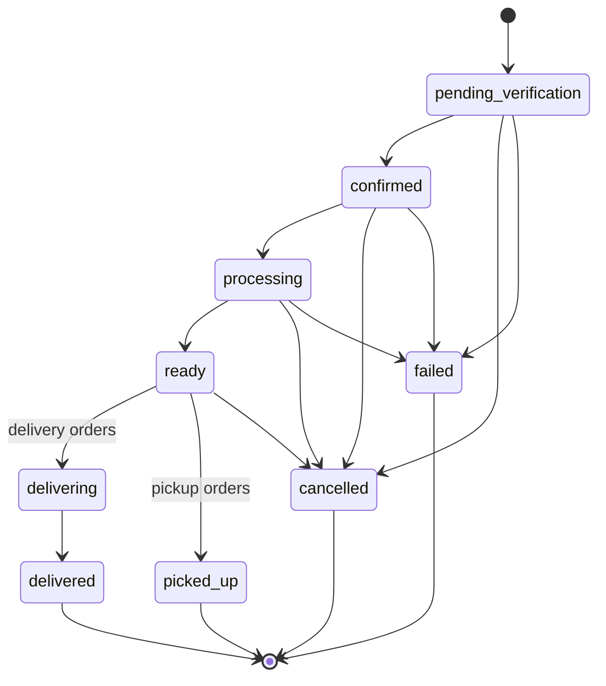
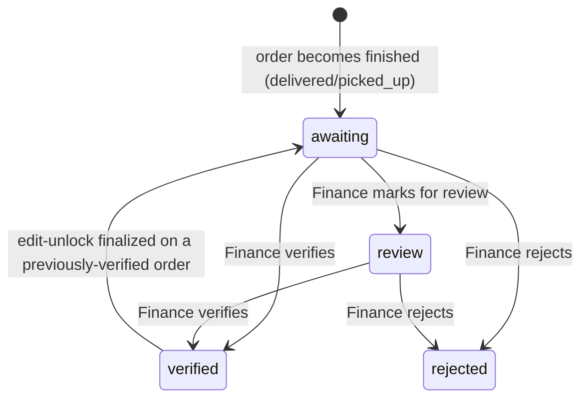
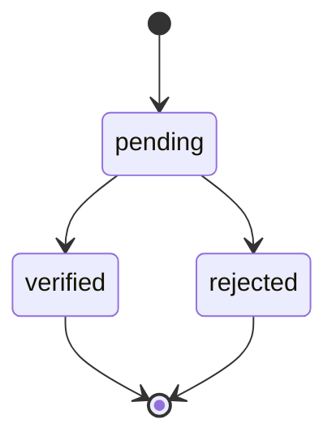
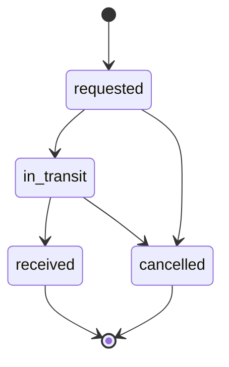

# Entities & State Machines

> **Current source of truth:** `UserRole` is `owner | admin | finance | hr | florist`. The legacy `employee` value is migrated to `florist`.

**Status: living document.** This is the shared vocabulary every other file in
`docs/business-rules/` builds on. If you rename a status, add a role, or
change a transition, update this file first — the action tables elsewhere
reference these names verbatim.

**Source of truth today is the codebase, not this doc.** Everything below was
reverse-engineered from `src/types/orders.ts`, `src/store/*StoreTypes.ts`,
and `src/domain/*Domain.ts` as of this writing. Where the current frontend
enforces something, that's noted. Where it's currently only a UI convention
(a button happens not to be shown) rather than an enforced rule, that's
flagged explicitly — those are exactly the gaps a real backend must close.
See `gap-log.md` for the full list of contradictions found while writing
this.

---

## Order

Defined in `src/types/orders.ts` (`OrderTableRow`, `OrderStatus`,
`PaymentStatus`).

### Order status

| Status | Meaning | Terminal? |
|---|---|---|
| `pending_verification` | Order just created, awaiting confirmation | No |
| `confirmed` | Order accepted into the fulfillment pipeline | No |
| `processing` | Being prepared (florist assigned) | No |
| `ready` | Ready for delivery dispatch or pickup | No |
| `delivering` | Courier en route (delivery orders only) | No |
| `delivered` | Completed — delivery orders | **Yes** (finished) |
| `picked_up` | Completed — pickup orders | **Yes** (finished) |
| `cancelled` | Cancelled before/during fulfillment | **Yes** (issue) |
| `failed` | Fulfillment failed | **Yes** (issue) |

- `delivered` / `picked_up` are called **"finished"** in code
  (`isOrderFinished`, `FINISHED_ORDER_STATUSES` in `orderWorkflowDomain.ts`).
  This is the trigger for Finance eligibility and the edit lock (see below).
- `cancelled` / `failed` are called **"terminal issue"** statuses
  (`TERMINAL_ISSUE_STATUSES`). They are excluded from finished-order and
  verified-cash operational views; refunds remain separate linked ledger events.
- **Guarded writer (Step 7B, 2026-07-10):** every runtime order-status
  mutation now runs through `transitionOrderStatus`. It enforces the delivery
  and pickup next-step matrices, role/section permission, the finished-order
  lock, terminal-state immutability, cancellation/failure rules, and an exact
  Undo contract. Both direct workflow changes and approved cancellation use
  this same command. See `gap-log.md` §1 and `status-writers.md`.

### Payment status

| Status | Meaning |
|---|---|
| `unpaid` | No payment recorded |
| `partial` | Some payment received (`paidAmountIdr` < `totalIdr`) |
| `paid` | Fully paid |
| `refund_pending` | A refund has been requested but not completed |
| `refunded` | Refund completed |

- Refund states are writable only through dedicated Finance/Owner refund
  commands. Completion records an immutable payment event and a linked refund
  transaction. Cancellation/void and refund remain separate decisions; see
  `refunds-and-voids.md` and `gap-log.md` §2/§11.

### Finance verification status

Distinct from order status and payment status — tracked via
`financeVerified: boolean` plus an optional
`financeVerificationStatus: 'rejected' | 'review' | undefined`.

| State | `financeVerified` | `financeVerificationStatus` | Meaning |
|---|---|---|---|
| Not yet eligible | `false`/undefined | undefined | Order hasn't finished fulfillment yet |
| Awaiting | `false` | undefined | Finished, sitting in the verification queue |
| Verified | `true` | undefined (cleared) | Confirmed — see `applyFinanceVerification` |
| Rejected | `false` | `'rejected'` | Flagged as not payable as recorded |
| Marked for review | `false` | `'review'` | Soft flag, not a decision — still shows in queue |

Source: `isPendingFinanceVerification`, `isMarkedForFinanceReview`,
`isRejectedByFinance` in `orderWorkflowDomain.ts`. Only Finance and Owner
roles can move an order between these states (`FINANCE_LOCK_OVERRIDE_ROLES =
['finance', 'owner']`).

### Edit-lock state (derived, not stored directly)

`isOrderLocked(order) = isOrderFinished(order) && !order.editUnlocked`

An order is **locked** the moment it finishes fulfillment (delivered/picked
up) — *not* only once Finance verifies it. While locked:
- Only `finance` role can edit or void it directly (`EDIT_LOCK_OVERRIDE_ROLES
  = ['finance']`) — note this does **not** include `owner`.
- `admin` and `owner` may only submit an `OrderChangeRequest` (`edit` or
  `cancel`) for Finance/Owner to review (`canSubmitChangeRequest`).
- Approving a `cancel` request voids the order directly. Approving an `edit`
  request does **not** apply any change itself — it sets `editUnlocked:
  true`, a one-time exemption consumed the moment the actual edit is saved
  (`finalizeUnlockedEdit`). If the order had been finance-verified,
  finalizing the edit resets `financeVerified` back to `false` — the
  revision may have changed the numbers Finance already signed off on.

Source: full commentary in `orderWorkflowDomain.ts` lines 1–33 (worth reading
in full — it explains the "why" better than this summary does).

---

## Finance Transaction (general ledger)

Defined in `src/store/financeStoreTypes.ts`. Distinct from order-level
Finance verification above — this is the general income/expense ledger
(rent, payroll, supplies, plus order payments recorded as `order_payment`
income).

| Status | Meaning |
|---|---|
| `pending` | Recorded, not yet reconciled |
| `verified` | Confirmed accurate — counts toward totals |
| `rejected` | Flagged incorrect/duplicate — excluded from totals |

Only `verified` transactions count toward `getFinanceSummary`'s totals
(`financeDomain.ts`). `verifyTransaction` and `rejectTransaction` in
`financeStore.ts` are the live writers. Both use
`canMakeFinanceTransactionDecision`, which permits Finance-only decisions from
`pending`; `verified` and `rejected` are immutable terminal states.

---

## Stock Item & Stock Transfer

Defined in `src/store/stockStoreTypes.ts`.

### Stock item status

| Status | Meaning |
|---|---|
| `active` | Normal |
| `low` | At/below `lowStockThreshold` |
| `expired` | Past `expiryDate` |
| `in_transit` | Currently part of an active transfer |

### Stock transfer status

This diagram is enforced by `canTransitionStockTransferStatus` at the
store-writer boundary. `received` and `cancelled` are immutable terminal
states; see `status-writers.md` and resolved `gap-log.md` §28.

### Cross-module: Order → Stock

There is no automatic Order → Stock integration. Catalog Materials Recipes were removed, so Orders do not reserve, consume, or restore Stock. Stock mutations remain explicit Inventory operations.

---

## Roles & Permissions

`UserRole = 'owner' | 'admin' | 'finance' | 'hr' | 'florist'`
(`src/store/userStore.ts`).

Section-level access (`none | view | edit`) per role is defined in
`src/config/permissions.ts` (`DEFAULT_ROLE_SECTION_ACCESS`) — see
`permissions.md` for the full Section Access and Detailed Feature Access model.

The local prototype backend handles sessions and persistence. Section and detailed-feature permissions remain application rules; production deployment must enforce the same rules server-side.
